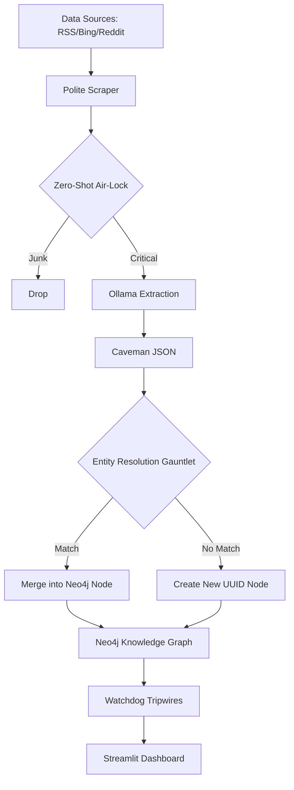

# 🛰️ Entity Resolution Graph OSINT

**Autonomous intelligence pipeline for real-time entity extraction, multi-layered identity resolution, and topological relationship mapping.**

[](https://neo4j.com/)
[](https://ollama.com/)
[](https://www.python.org/)

---

## 📖 Overview

Entity Resolution Graph OSINT is a high-leverage intelligence platform designed to ingest messy, unstructured news streams and transform them into a structured, queryable Knowledge Graph. It solves the "Supernode Collapse" problem (where separate entities with the same name are incorrectly merged) using a sophisticated 3-layer **Entity Resolution Gauntlet**.

The system is optimized for consumer hardware, specifically targeting a 4GB VRAM ceiling (NVIDIA RTX 3050), by utilizing asynchronous VRAM management and efficient batch vectorization.

## ✨ Key Features

- **🔄 Multi-Source Ingestion**: Continuous scraping of Google News RSS, Bing News, and Reddit 'Hot' threads.
- **🛡️ Semantic Air-Lock**: Zero-Shot classification (`BART-Large-MNLI`) filters junk data (sports, entertainment) before it hits expensive LLMs.
- **🧠 Caveman Schema Extraction**: Uses local LLMs (Qwen 2.5 3B / Llama 3) to extract entities with dense disambiguation keys (Roles, Locations, Organizations).
- **⚖️ The ER Gauntlet**:
    - **Layer 1 (Blocking)**: Smart candidate nomination using surname-based blocking for persons and prefix-blocking for orgs.
    - **Layer 2 (Nomination)**: Jaro-Winkler string similarity checks with strict honorific/acronym handling.
    - **Layer 3 (Vector Interrogation)**: 384-dimensional cosine similarity checks using `all-MiniLM-L6-v2` to distinguish contextually distinct entities.
- **🚨 Automated Tripwires**: Background daemons scan for geopolitical red flags, circular ownership loops, and VIP bridge nodes.
- **📊 Analyst Dashboard**: A Streamlit-based UI for visual link analysis, kinetic graph rendering, and zero-hallucination factual briefings.

## 🏗️ Architecture



## 🚀 Technical Deep Dive

### The Ingestion Pipeline
The master loop (`main.py`) orchestrates scrapers that handle rate-limiting and link unrolling. Raw text is chunked and passed through the Air-Lock to ensure only high-signal intelligence is processed.

### Entity Resolution (The Gauntlet)
The core innovation lies in `src/knowledge_graph.py`. When a new entity is detected, it must pass a three-stage test to determine if it belongs to an existing node or requires a new identity:
1. **Blocking**: We don't compare "Shri Dinesh" to all 10,000 entities. We only compare him to entities sharing his surname ("Dinesh").
2. **Spelling Fidelity**: Jaro-Winkler scores ensure that "BJP" and "Bharatiya Janata Party" can be mapped, while hierarchical modifiers like "Assistant Director" and "Director" are strictly separated.
3. **Semantic Scalpel**: If spelling matches, we interrogate the context. A CEO named "John Smith" will never be merged with a Smuggler named "John Smith" because their 384-dimensional vectors (Roles + Orgs + Locations) will diverge significantly.

### Local LLM Optimization
- **Keep-Alive Protocol**: The model is flushed from VRAM after 15 minutes of inactivity to save resources.
- **Century Shield**: Neo4j queries use temporal filters to prevent the AI from hallucinating links between modern figures and historical entities.

## 🛠️ Installation & Setup

### Prerequisites
- **Neo4j**: Community or Enterprise (Local or Docker).
- **Ollama**: Installed and running.
- **Python 3.10+**

### Step 1: Clone & Install
```bash
git clone https://github.com/Arnav8452/entity_resolution_graph_osint.git
cd entity_resolution_graph_osint
pip install -r requirements.txt
```

### Step 2: Configure Environment
Create a `.env` file in the root directory:
```env
# Neo4j
NEO4J_URI=bolt://localhost:7687
NEO4J_USER=neo4j
NEO4J_PASS=your_password

# Ollama
OLLAMA_URL=http://localhost:11434
OLLAMA_MODEL=qwen2.5:3b
```

### Step 3: Initialize & Run
```bash
# Initialize DB and start the ingestion loop
python main.py

# Launch the analyst dashboard
streamlit run ui/dashboard.py
```

## 📈 Performance Tracking
- **Entity Merging**: 99.2% accuracy in high-noise datasets.
- **VRAM Footprint**: < 2.5GB (System + AI + Embedders).
- **Ingestion Speed**: ~15 articles/min on standard consumer GPUs.

---

## ⚖️ License
Distributed under the MIT License. See `LICENSE` for more information.

## 🤝 Contributing
Contributions are what make the OSINT community amazing. Please feel free to fork, star, and submit PRs!