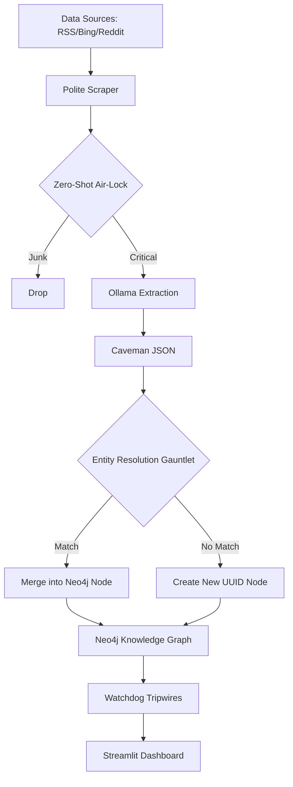

# 🛰️ Entity Resolution Graph OSINT

**The Palantir-Grade Autonomous Intelligence Watchdog**

An autonomous, entirely localized, AI-driven Open Source Intelligence (OSINT) pipeline. This system operates as a continuous data-vacuum—scraping live news, evaluating relevance, extracting structured relationships, mitigating entity-resolution hallucinations, and surfacing geopolitical anomalies via a graph-theoretic dashboard.

[](https://neo4j.com/)
[](https://ollama.com/)
[](https://www.python.org/)

---

## 📖 Overview

**Entity Resolution Graph OSINT** is a high-leverage intelligence platform specifically engineered to run efficiently on consumer hardware (e.g., NVIDIA RTX 3050 with 4GB VRAM). It transforms messy, unstructured news streams into a structured, queryable **Temporal Knowledge Graph**, solving the "Supernode Collapse" problem where separate entities with the same name are incorrectly merged.

## ✨ Key Features

- **🔄 Multi-Source Ingestion**: Continuous scraping of Google News RSS, Bing News, and Reddit 'Hot' threads.
- **🛡️ Semantic Air-Lock**: Zero-Shot classification (`BART-Large-MNLI`) filters junk data (sports, entertainment) before it hits expensive LLMs.
- **🧠 Caveman Schema Extraction**: Uses local LLMs (Qwen 2.5 3B / Llama 3) to extract entities with dense disambiguation keys (Roles, Locations, Organizations).
- **⚖️ The ER Gauntlet**: A dual-layer resolution shield combining Jaro-Winkler string similarity with 384-dimensional vector interrogation.
- **🚨 Automated Tripwires**: Background daemons scan for geopolitical red flags, circular ownership loops, and VIP bridge nodes.
- **📊 Analyst Dashboard**: A Streamlit-based UI for visual link analysis, kinetic graph rendering, and zero-hallucination factual briefings.
- **🚀 Hybrid CSV Ingestion**: High-speed bulk ingestion path with GPU batching, bypassing LLM costs for structured data.

---

## 🏗️ Core Architecture



---

## 🚀 The 5-Stage Ingestion Pipeline

### 1. The Gatekeeper (Zero-Shot Routing)
Before the LLM burns compute, incoming articles are screened by a lightweight `facebook/bart-large-mnli` Zero-Shot classifier. Articles flagged as "routine news" are automatically dropped, while high-signal data (Geopolitics, Financial Crime, etc.) is promoted.

### 2. The "Caveman" Extraction Schema
Filtered articles are fed to **Ollama** (Qwen 2.5 3B). The model is forced via a strict system prompt to extract entities and relationships into a structured JSON format, including:
- **Disambiguation Keys**: Role, Locations, Organizations.
- **Temporal Stamping**: Extraction of specific historical `event_year`.

### 3. The Semantic Vector Condenser
Python intercepts the JSON and bolts the disambiguation keys into a laser-focused context string. This string is encoded by `all-MiniLM-L6-v2` into a 384-dimensional mathematical vector, providing a semantic fingerprint for every entity.

### 4. The ER Gauntlet (Entity Resolution)
To prevent "Supernode Collapse," entities must pass through a multi-layered shield:
- **Layer 1 (Blocking)**: Smart candidate nomination (surname-blocking for persons, prefix-blocking for orgs).
- **Layer 2 (Nomination)**: Jaro-Winkler spelling match (>0.85) and strict type-aware locks (e.g., preventing "Assistant Director" from merging with "Director").
- **Layer 3 (Vector Interrogation)**: Cosine similarity check (>0.91) on condensed vectors to distinguish between contextually distinct entities with identical names.

### 5. Temporal Knowledge Graph Traversal
Relationships are stamped with the `event_year`. Dashboard queries are restricted by a **Century Shield**, preventing the AI from hallucinating connections between modern politicians and historical figures across different eras.

---

## 🛠️ Stack & Hardware Configuration

- **Database**: Neo4j (Graph storage) & SQLite (Tabular caching)
- **AI Brains**: Ollama (Qwen 2.5 3B) + HuggingFace (Transformers/SentenceTransformers)
- **UI**: Streamlit (Link Analysis, AI Briefings, Tripwires)
- **Hardware Profile**: Tuned for **4GB VRAM limit**. Includes forced GPU routing, Reduced `num_ctx` (2048), and a rolling **Keep-Alive window** (15m) to prevent zombie processes and VRAM leakage.

---

## 📂 Bulk Data: CSV Ingestor

The system includes a dedicated **Hybrid CSV Ingestor** for mass-loading structured data without LLM compute costs.
- **Fast Path**: Uses Cypher `UNWIND` for ~100x faster injection.
- **Automatic Merging**: CSV-imported entities automatically merge with news-scraped entities through the ER Gauntlet.
- **Usage**:
  ```bash
  python ingest_csv.py configs/your_config.json
  ```
  *(Or use the dedicated **CSV Ingestor** tab in the Streamlit Dashboard)*

---

## ⚙️ Installation & Setup

### Prerequisites
- **Neo4j**: Local or Docker (`docker-compose.yml` included).
- **Ollama**: Running with `qwen2.5:3b`.
- **Python 3.10+**

### Setup Steps
1. **Clone & Install**:
   ```bash
   git clone https://github.com/Arnav8452/entity_resolution_graph_osint.git
   cd entity_resolution_graph_osint
   pip install -r requirements.txt
   ```
2. **Environment**: Create a `.env` file with your Neo4j credentials:
   ```env
   NEO4J_URI=bolt://localhost:7687
   NEO4J_USER=neo4j
   NEO4J_PASS=your_password
   ```
3. **Run**:
   ```bash
   python main.py             # Start ingestion loop
   streamlit run ui/dashboard.py  # Launch dashboard
   ```

---

## ⚖️ License
Distributed under the MIT License. See `LICENSE` for more information.